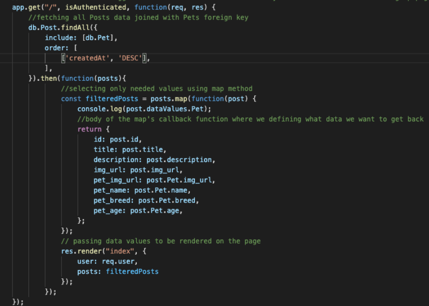
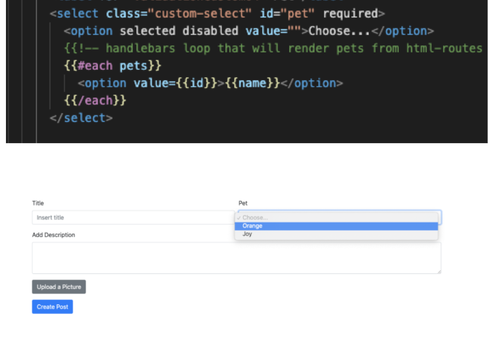
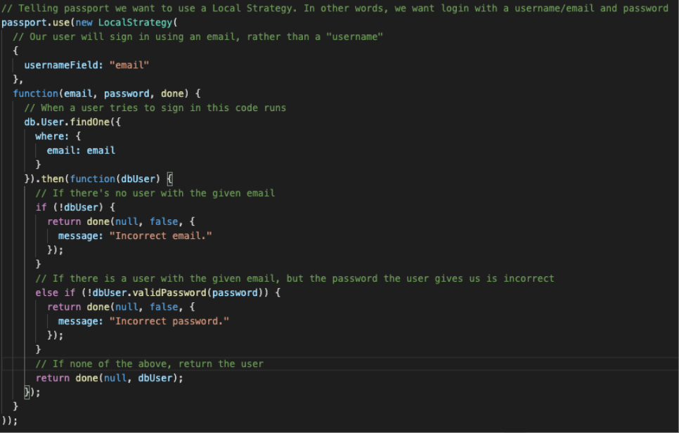

# project-2
## Happy Paw

## Link to the deployed application
-   [Happy Paw](https://happypaw.herokuapp.com/)
#### Log in credentials 
- username: liza@gmail.com
- password: password
## Getting Started 
You can easily clone our github repo on your local machince for development. 
1. Open your terminal or gitbash if your are using a PC.
2. Go to our github and click on code and copy "git@github.com:liza-p/project-2.git"
3. Once you've done that open your terminal and type git clone git@github.com:liza-p/project-2.git
4. This should start downloading and transfering it to your desktop.
5. Open your editor and mysql workbench to get you started. enjoy!

## Why make it?
Socializing your pets is extremely important. If you’ve ever owned a pet you know that it’s needed in the development of a pets personality and allows them to grow and be used to interacting with other animals. 
We wanted to create an environment where users can meet other users with like interests and pets.

## Code Highlights

 Code snippet of Sequelize Join query
 
 

 Code snippet of using Handlebars 

 

 Code snippet of using Passport.js

 

## Technologies Used
- JavaScript - Core logic
- Node and NPM
- Handlebar
- Express
- MySQL
- ORM Sequelize
- MVC (Model, View, and Controller)
- Passport.js
- Bootstrap
- CSS
- Git - version control system to track changes to source code
- GitHub - hosts repository
- Heroku - to host the application and the database
- Filestack - developer service for uploading images
## Contributors
- [Alex Aguirrebena](https://github.com/Anotherarod)
- [Isaias Del Mundo](https://github.com/idelmundo)
- [Liza Poliachenko](https://github.com/liza-p)
